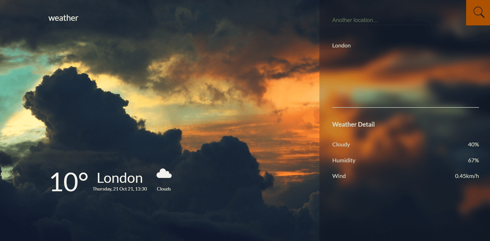

# ☀️ Weather App


## Front-end project using a third-party API

## ✏️ Description

**Weather App** is a responsive weather web application using React.js and the _openweathermap_ API. <br/>
Possibility to search a detailed weather forecast by city, with the rate of cloud cover, the rate of humidity and the force of the wind.<br/>
Dynamic change of the background depending on the weather (sunny, cloudy, fog ...)<br/>
Fully responsive application. <br/>
Upload with Vercel

## ⚡️ Overview



Design by Arthur K

## 🔥 Experience

This web application allowed me to enhance my bases in React.js with the creation of a custom Hooks for API requests. But also in responsive design with the CSS3 breakpoints.

## ⚙️ Techno used

  

## 🔧 Install

```
git clone https://github.com/Greepsu/weather-app
cd weather-app
npm start
```

## 💻 Links

Application: https://weather-app-eight-neon.vercel.app <br/>
Github: https://github.com/Greepsu/weather-app
